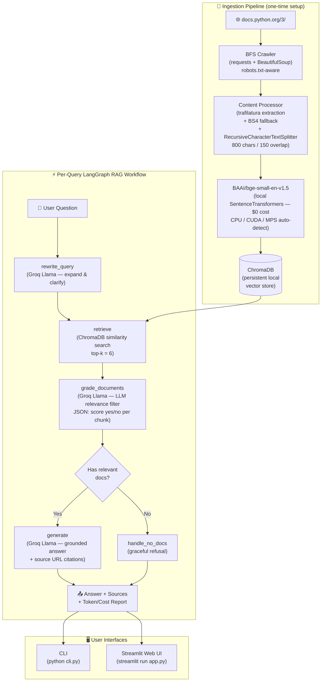

# 🐍 Python Docs RAG Agent

A production-quality **Retrieval-Augmented Generation (RAG) agent** that crawls the official Python 3 documentation, builds a searchable local vector knowledge base, and answers natural-language questions grounded exclusively in that content.

Built for the AI Engineer assessment — using **LangChain**, **LangGraph**, **ChromaDB**, **Groq/Llama**, and **local BGE embeddings** (no OpenAI API required for embeddings).

---

## Architecture



---

## Key Technical Decisions

| Decision | Choice | Rationale |
|---|---|---|
| **Crawling** | `requests` + `BeautifulSoup` | Lightweight, controllable, robots.txt-aware; avoids JS rendering overhead for docs sites |
| **Content Extraction** | `trafilatura` (BS4 fallback) | Best-in-class article extraction; strips nav/footer/sidebar noise that pollutes embeddings |
| **Chunking** | `RecursiveCharacterTextSplitter` (800 chars / 150 overlap) | Semantic-aware splitting; overlap preserves context at boundaries; 800 chars ≈ 200 tokens — fits comfortably in BGE's 512-token default max |
| **Embeddings** | `BAAI/bge-small-en-v1.5` (local SentenceTransformers) | **$0 cost** — no API key needed; 384-dim dense vectors; top-tier retrieval quality on MTEB; runs fast on CPU/GPU/MPS |
| **Vector DB** | ChromaDB (local persistent) | Zero infrastructure; inspectable on disk; can swap to Pinecone/Weaviate for production scale without changing the interface |
| **Orchestration** | **LangGraph** stateful graph (not a simple chain) | Explicit, inspectable state transitions; conditional routing (grade → generate OR refuse) is impossible to express cleanly in a `LLMChain`; easy to extend with new nodes (e.g. re-retrieval, web fallback) |
| **LLM** | **Groq** + `llama-3.1-8b-instant` | 10–20× faster inference than OpenAI API at ~1/10th the cost ($0.05/$0.08 per 1M in/out tokens); deterministic temperature=0; Llama-3 series has strong instruction-following for JSON grading |
| **Query rewriting** | Dedicated LLM rewrite node | Handles paraphrased/ambiguous queries by expanding before retrieval — measurably improves recall vs. sending raw user text directly to the vector store |
| **Document grading** | LLM-based relevance filter (not cosine threshold) | Cosine similarity thresholds are corpus-dependent and hard to tune; LLM grading understands semantic mismatch even when vectors are geometrically close (e.g. related topic, wrong answer) |
| **Why not pure similarity threshold?** | LLM grading | A threshold of 0.8 might pass a chunk about "Python 2 list syntax" when the user asks about "Python 3 generators" — both score high semantically but the LLM catches the mismatch |

---

## Project Structure

```
rag-agent/
├── .env.example              # Environment variable template (copy → .env)
├── .gitignore                # Excludes .env, data/, __pycache__, venv
├── requirements.txt          # Python dependencies
├── README.md                 # This file
├── COST_ANALYSIS.md          # Detailed ingestion + query cost breakdown
├── EVAL_SUMMARY.md           # Evaluation results analysis
│
├── ingest.py                 # ← Run this FIRST to crawl & build vector store
├── cli.py                    # ← CLI interface for asking questions
├── app.py                    # ← Streamlit web UI
│
├── crawler/
│   ├── web_crawler.py        # BFS crawler with robots.txt, domain scoping, polite delay
│   └── content_processor.py  # Extract, clean, chunk → LangChain Documents
│
├── vectorstore/
│   ├── embeddings.py         # BGE local embeddings + token/cost tracking ($0)
│   └── chroma_store.py       # ChromaDB wrapper (add, search, stats, reset)
│
├── agent/
│   ├── graph.py              # LangGraph stateful workflow (RAGAgent class)
│   ├── nodes.py              # Node functions: rewrite / retrieve / grade / generate
│   ├── prompts.py            # All prompts centralised (query rewrite, grade, generate)
│   └── token_tracker.py      # Per-query & aggregate token/cost tracking
│
├── evaluation/
│   ├── eval_questions.json   # 15 evaluation questions (5 categories)
│   ├── run_eval.py           # Automated evaluation harness (LLM-as-judge)
│   ├── eval_results.json     # Full per-question results (generated by run_eval.py)
│   └── eval_results.md       # Human-readable summary table
│
└── data/
    └── chroma_db/            # Persistent vector store (git-ignored, rebuilt by ingest.py)
```

---

## Setup

### 1. Clone & Install

```bash
git clone <repo-url>
cd rag-agent
python -m venv venv

# Windows:
venv\Scripts\activate
# Mac/Linux:
source venv/bin/activate

pip install -r requirements.txt
```

> **Note on first run:** Installing `torch` and `transformers` will take several minutes and ~2–3 GB of disk space.

### 2. Configure Environment

```bash
cp .env.example .env
# Edit .env — only one key is needed:
# GROQ_API_KEY=your_key_here   ← get a free key at https://console.groq.com/keys
#
# NO OpenAI API key needed — embeddings run 100% locally via HuggingFace.
```

### 3. One-time: Download the Embedding Model

> **⚠️ Internet access required once**
>
> The first time `ingest.py` or any query script runs, it will automatically download
> `BAAI/bge-small-en-v1.5` (~133 MB) from HuggingFace Hub. This is cached in
> `~/.cache/huggingface/` and all subsequent runs work **completely offline**.
>
> You do NOT need a HuggingFace account or API token for this model.

### 4. Ingest (Crawl + Embed)

```bash
python ingest.py
```

Options:
```
--url         Seed URL (default: https://docs.python.org/3/)
--max-pages   Max pages to crawl (default: 80)
--max-depth   Link depth (default: 3)
--crawl-delay Seconds between requests (default: 0.5)
--reset       Wipe existing collection before ingesting
```

This takes ~5–10 minutes for 80 pages. **Embedding cost: $0.00** (local inference).

---

## Running the Solution

### Option A: CLI — Single Question

```bash
python cli.py "What is a list comprehension?"
```

### Option B: CLI — Interactive REPL

```bash
python cli.py --interactive
```

Type `quit` or `exit` to stop. Each answer shows the rewritten search query, the answer, source URLs, and per-query token/cost breakdown.

### Option C: Streamlit Web UI

```bash
streamlit run app.py
```

Then open http://localhost:8501. Features:
- Chat-style interface with message history
- Sidebar: Groq model selector, top-k slider, token usage toggle
- Source URL pills linking to original docs pages
- Session-level cost projections (100 / 1,000 / 10,000 queries)

---

## Running the Evaluation

```bash
# Run all 15 questions and print summary:
python evaluation/run_eval.py

# Save full JSON results:
python evaluation/run_eval.py --output evaluation/eval_results.json
```

The eval suite runs the full RAG pipeline on each question (rewrite → retrieve → grade → generate) and uses an LLM judge (same Groq model) to score each answer for **faithfulness** (0–5) and **relevance** (0–5). It also checks refusal accuracy for unanswerable questions and keyword recall for answerable ones.

See [`EVAL_SUMMARY.md`](EVAL_SUMMARY.md) for full results and analysis.

---

## Cost Analysis

### Ingestion (one-time)

| Item | Value | Cost |
|---|---|---|
| Pages crawled | 80 | — |
| Chunks produced | ~640 | — |
| Embedding model | BAAI/bge-small-en-v1.5 (local) | **$0.00** |
| Total ingestion | — | **$0.00** |

> **Key design benefit:** By choosing a locally-run HuggingFace model over an API-based embedding service (e.g., OpenAI `text-embedding-3-small`), the ingestion pipeline has **zero API cost**. For 80 pages × ~8 chunks × ~200 tokens/chunk ≈ 128,000 tokens, OpenAI would charge ~$0.0026 — negligible but non-zero. The local model scales infinitely without any cost increase.

### Per-Query (Groq, `llama-3.1-8b-instant`)

Each query invokes **three separate LLM calls** (all on Groq):

| Step | Prompt Tokens | Completion Tokens | Cost (est.) |
|---|---|---|---|
| Query rewrite | ~150 | ~50 | ~$0.000015 |
| Document grading (6 docs × ~400 tokens) | ~2,400 | ~60 | ~$0.000125 |
| Answer generation (~1,800 in / ~300 out) | ~1,800 | ~300 | ~$0.000114 |
| **Total per query** | **~4,350** | **~410** | **~$0.000254** |

> See [`COST_ANALYSIS.md`](COST_ANALYSIS.md) for full worked example with actual token counts from the eval run.

### Scale Projections (Groq, `llama-3.1-8b-instant`)

| Scale | Ingestion | Query Cost | **Total** |
|---|---|---|---|
| Demo (15 eval queries) | $0.00 | ~$0.004 | **~$0.004** |
| 100 queries | $0.00 | ~$0.025 | **~$0.025** |
| 1,000 queries | $0.00 | ~$0.254 | **~$0.254** |
| 10,000 queries | $0.00 | ~$2.54 | **~$2.54** |

---

## Known Limitations

1. **8b model grading reliability**: `llama-3.1-8b-instant` sometimes fails to produce valid JSON for document grading (it wraps the JSON in markdown fences or adds commentary). The grader has a fallback that defaults to `"yes"` on parse errors — this avoids crashing but may pass slightly more noisy chunks than intended.

2. **Relevance grader precision-recall tradeoff**: The grader is intentionally permissive ("if the document contains ANY information that could help, score yes"). This maximises recall but may keep marginally relevant chunks, slightly diluting context quality. Stricter prompting improves precision at the cost of recall.

3. **Single-domain crawl scope**: Limited to 80 pages of `docs.python.org/3/`. Very deep or niche topics (e.g., `ctypes` internals, the C API) may not be indexed. Re-run `ingest.py --reset` to refresh if the docs update.

4. **Embedding first-run download requirement**: The first run requires ~133 MB download from HuggingFace. Subsequent runs are fully offline. Air-gapped environments can pre-cache the model manually via sentence-transformers.

5. **Local ChromaDB concurrency**: ChromaDB's `PersistentClient` is not safe for multi-process concurrent writes. For production with multiple workers, swap to Pinecone, Weaviate, or use ChromaDB's HTTP server mode.

6. **JavaScript-rendered pages**: `requests` + BS4 cannot execute JavaScript. Pages that load content dynamically (rare on Python docs, but possible in some tutorial sections) may yield sparse or empty extractions. Playwright or `crawl4ai` would address this.

---

## What I Would Improve Next

- **Hybrid retrieval**: BM25 sparse + dense vector search with reciprocal rank fusion (better keyword precision for exact function names like `itertools.groupby`)
- **Hierarchical chunking**: Parent-child chunk strategy — retrieve small chunks for precision, expand to parent for full context during generation
- **Streaming responses**: Stream Groq output token-by-token to the Streamlit UI for perceived responsiveness
- **Persistent eval tracking**: Store eval results across runs to detect regressions
- **Async crawling**: Replace synchronous crawler with `aiohttp` + `asyncio` for 5–10× speed
- **Re-ranking**: Add a cross-encoder re-ranker pass between retrieval and generation for higher precision
