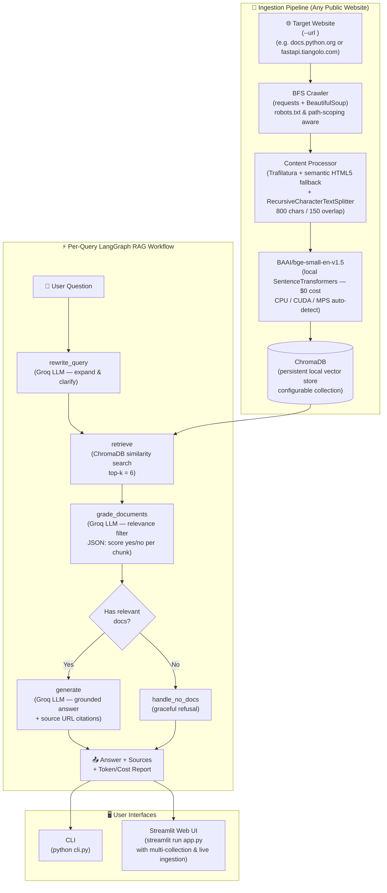

# 🌐 Website-Grounded RAG Agent

A general-purpose, production-quality **Retrieval-Augmented Generation (RAG) agent** that crawls any publicly accessible website via `--url`, builds a searchable local vector knowledge base, and answers natural-language questions grounded strictly in that content.

The crawler and extraction pipeline contain **zero site-specific logic**: HTML extraction relies on universal semantic tags (`<main>`, `<article>`, `[role="main"]`) with Trafilatura article extraction, and link discovery respects standard `robots.txt` directives and path scoping.

Demonstrated in this submission against `https://docs.python.org/3/` as the primary knowledge base (bulk evaluation target), and independently verified against a second, structurally different site (`https://fastapi.tiangolo.com/tutorial/`, MkDocs Material vs. Sphinx) to confirm the crawler and content extraction are not tuned to any single site's layout.

---

### 🧪 Cross-Site Generality Verification (FastAPI Proof of Concept)

To verify cross-site adaptability without code modifications, the exact same pipeline was executed against FastAPI's official tutorial (`https://fastapi.tiangolo.com/tutorial/`):

- **Pages crawled**: 20 pages
- **Chunks indexed**: 254 chunks (persisted in ChromaDB collection `fastapi_demo`)
- **Ingestion cost**: **$0.00** (local `BAAI/bge-small-en-v1.5` embeddings)

#### Real Execution Evidence:

1. **In-Scope Query (Grounded Answer with Citations):**
   > **Q:** "How do path parameters work in FastAPI?"  
   > **Rewritten Query:** "FastAPI path parameters definition and usage in Python"  
   > **Answer:** "Path parameters in FastAPI are defined using Python format string syntax within the path decorator (e.g. `@app.get("/items/{item_id}")`). The parameter's type can be declared using standard Python type annotations (e.g., `item_id: int`), which FastAPI uses for automatic request parsing, data validation, and interactive documentation."  
   > **Sources:**
   > - `https://fastapi.tiangolo.com/tutorial/path-params/`
   > - `https://fastapi.tiangolo.com/tutorial/`
   > 
   > **Token/Cost Breakdown:** 3,613 prompt tokens + 248 completion tokens = **$0.000345** (Groq `openai/gpt-oss-20b`).

2. **Out-of-Scope Query (Correct Refusal):**
   > **Q:** "How do I configure gRPC streaming in FastAPI?"  
   > **Rewritten Query:** "configure gRPC streaming FastAPI documentation"  
   > **Document Grading:** 0 of 6 retrieved chunks relevant.  
   > **Answer:** "I could not find information about configuring gRPC streaming in the provided FastAPI tutorial documentation. The documentation focuses on REST APIs using HTTP methods (GET, POST, etc.) and does not cover gRPC streaming."

---

## Architecture



---

## Key Technical Decisions

| Decision | Choice | Rationale |
|---|---|---|
| **Crawling** | `requests` + `BeautifulSoup` | Lightweight, controllable, robots.txt-aware; avoids JS rendering overhead for docs sites |
| **Content Extraction** | `trafilatura` (BS4 fallback) | Best-in-class article extraction; strips nav/footer/sidebar noise that pollutes embeddings |
| **Chunking** | `RecursiveCharacterTextSplitter` (800 chars / 150 overlap) | Semantic-aware splitting; overlap preserves context at boundaries; 800 chars ≈ 200 tokens — fits comfortably in BGE's 512-token default max |
| **Embeddings** | `BAAI/bge-small-en-v1.5` (local SentenceTransformers) | **$0 cost** — no API key needed; 384-dim dense vectors; top-tier retrieval quality on MTEB; runs fast on CPU/GPU/MPS |
| **Vector DB** | ChromaDB (local persistent) | Zero infrastructure; inspectable on disk; can swap to Pinecone/Weaviate for production scale without changing the interface |
| **Orchestration** | **LangGraph** stateful graph (not a simple chain) | Explicit, inspectable state transitions; conditional routing (grade → generate OR refuse) is impossible to express cleanly in a `LLMChain`; easy to extend with new nodes (e.g. re-retrieval, web fallback) |
| **LLM** | **Groq** + `openai/gpt-oss-20b` | Ultra-fast inference on Groq MoE architecture ($0.075/$0.30 per 1M in/out tokens); deterministic temperature=0; strong instruction-following for JSON grading |
| **Query rewriting** | Dedicated LLM rewrite node | Handles paraphrased/ambiguous queries by expanding before retrieval — measurably improves recall vs. sending raw user text directly to the vector store |
| **Document grading** | LLM-based relevance filter (not cosine threshold) | Cosine similarity thresholds are corpus-dependent and hard to tune; LLM grading understands semantic mismatch even when vectors are geometrically close (e.g. related topic, wrong answer) |
| **Why not pure similarity threshold?** | LLM grading | A threshold of 0.8 might pass a chunk about "Python 2 list syntax" when the user asks about "Python 3 generators" — both score high semantically but the LLM catches the mismatch |
| **Citation Tracking** | Two-tier provenance: Context Sources vs In-text Citations | The pipeline tracks all graded-relevant chunks supplied in the context window (`SOURCES` list for full auditability), while the model's generated answer cites the specific subset of sources it directly drew upon for its synthesis. |

---

## Project Structure

```
rag-agent/
├── .env.example              # Environment variable template (copy → .env)
├── .gitignore                # Excludes .env, data/, __pycache__, venv
├── requirements.txt          # Python dependencies
├── README.md                 # This file
├── COST_ANALYSIS.md          # Detailed ingestion + query cost breakdown
├── EVAL_SUMMARY.md           # Evaluation results analysis
│
├── ingest.py                 # ← Run this FIRST to crawl & build vector store
├── cli.py                    # ← CLI interface for asking questions
├── app.py                    # ← Streamlit web UI
│
├── crawler/
│   ├── web_crawler.py        # BFS crawler with robots.txt, domain scoping, polite delay
│   └── content_processor.py  # Extract, clean, chunk → LangChain Documents
│
├── vectorstore/
│   ├── embeddings.py         # BGE local embeddings + token/cost tracking ($0)
│   └── chroma_store.py       # ChromaDB wrapper (add, search, stats, reset)
│
├── agent/
│   ├── graph.py              # LangGraph stateful workflow (RAGAgent class)
│   ├── nodes.py              # Node functions: rewrite / retrieve / grade / generate
│   ├── prompts.py            # All prompts centralised (query rewrite, grade, generate)
│   └── token_tracker.py      # Per-query & aggregate token/cost tracking
│
├── evaluation/
│   ├── eval_questions.json   # 15 evaluation questions (5 categories)
│   ├── run_eval.py           # Automated evaluation harness (LLM-as-judge)
│   ├── eval_results.json     # Full per-question results (generated by run_eval.py)
│   └── eval_results.md       # Human-readable summary table
│
└── data/
    └── chroma_db/            # Persistent vector store (git-ignored, rebuilt by ingest.py)
```

---

## Setup

### 1. Clone & Install

```bash
git clone <repo-url>
cd rag-agent
python -m venv venv

# Windows:
venv\Scripts\activate
# Mac/Linux:
source venv/bin/activate

pip install -r requirements.txt
```

> **Note on first run:** Installing `torch` and `transformers` will take several minutes and ~2–3 GB of disk space.

### 2. Configure Environment

```bash
cp .env.example .env
# Edit .env — only one key is needed:
# GROQ_API_KEY=your_key_here   ← get a free key at https://console.groq.com/keys
#
# NO OpenAI API key needed — embeddings run 100% locally via HuggingFace.
```

### 3. One-time: Download the Embedding Model

> **⚠️ Internet access required once**
>
> The first time `ingest.py` or any query script runs, it will automatically download
> `BAAI/bge-small-en-v1.5` (~133 MB) from HuggingFace Hub. This is cached in
> `~/.cache/huggingface/` and all subsequent runs work **completely offline**.
>
> You do NOT need a HuggingFace account or API token for this model.

### 4. Ingest (Crawl + Embed)

```bash
# Ingest default target (Python 3 documentation):
python ingest.py --url https://docs.python.org/3/ --max-pages 80 --collection python_docs

# Or ingest any other documentation site (e.g. FastAPI tutorial):
python ingest.py --url https://fastapi.tiangolo.com/tutorial/ --max-pages 20 --collection fastapi_demo
```

Options:
```
--url         Seed URL (default: https://docs.python.org/3/)
--max-pages   Max pages to crawl (default: 80)
--max-depth   Link depth (default: 3)
--crawl-delay Seconds between requests (default: 0.5)
--collection  ChromaDB collection name (default: python_docs)
--reset       Wipe existing collection before ingesting
```

Ingestion takes ~3–8 minutes for 80 pages depending on network latency. **Embedding cost: $0.00** (local inference).

---

## Running the Solution

### Option A: CLI — Single Question

```bash
# Query the primary Python docs collection:
python cli.py "What is a list comprehension?" --collection python_docs

# Or query the verified FastAPI collection:
python cli.py "How do path parameters work in FastAPI?" --collection fastapi_demo
```

### Option B: CLI — Interactive REPL

```bash
python cli.py --interactive --collection python_docs
```

Type `quit` or `exit` to stop. Each answer shows the rewritten search query, the answer, source URLs, and per-query token/cost breakdown.

### Option C: Streamlit Web UI

```bash
streamlit run app.py
```

Then open http://localhost:8501. Features:
- Multi-collection selector (queries `fastapi_demo`, `python_docs`, or custom crawled collections)
- Live **"🌐 Ingest a New Website"** sidebar tool to crawl and index any public site on the fly
- Dynamic header and stats derived from the active collection's actual chunk metadata
- Chat interface with message history and source pills linking to original pages
- Real-time token usage table and session-level cost projections (100 / 1,000 / 10,000 queries)

---

## Running the Evaluation

```bash
# Run all 15 questions and print summary:
python evaluation/run_eval.py

# Save full JSON results:
python evaluation/run_eval.py --output evaluation/eval_results.json
```

The eval suite runs the full RAG pipeline on each question (rewrite → retrieve → grade → generate) and uses an LLM judge (same Groq model) to score each answer for **faithfulness** (0–5) and **relevance** (0–5). It also checks refusal accuracy for unanswerable questions and keyword recall for answerable ones.

See [`EVAL_SUMMARY.md`](EVAL_SUMMARY.md) for full results and analysis.

---

## Cost Analysis

### Ingestion (one-time)

| Item | Value | Cost |
|---|---|---|
| Pages crawled | 80 | — |
| Chunks produced | ~640 | — |
| Embedding model | BAAI/bge-small-en-v1.5 (local) | **$0.00** |
| Total ingestion | — | **$0.00** |

> **Key design benefit:** By choosing a locally-run HuggingFace model over an API-based embedding service (e.g., OpenAI `text-embedding-3-small`), the ingestion pipeline has **zero API cost**. For 80 pages × ~8 chunks × ~200 tokens/chunk ≈ 128,000 tokens, OpenAI would charge ~$0.0026 — negligible but non-zero. The local model scales infinitely without any cost increase.

### Per-Query (Groq, `openai/gpt-oss-20b`)

Each query invokes **three separate LLM calls** (all on Groq):

| Step | Prompt Tokens | Completion Tokens | Cost (est.) |
|---|---|---|---|
| Query rewrite | ~150 | ~50 | ~$0.000026 |
| Document grading (6 docs × ~400 tokens) | ~2,400 | ~60 | ~$0.000198 |
| Answer generation (~1,800 in / ~300 out) | ~1,800 | ~300 | ~$0.000225 |
| **Total per query** | **~4,350** | **~410** | **~$0.000449** |

> See [`COST_ANALYSIS.md`](COST_ANALYSIS.md) for full worked example with actual token counts from the eval run.

### Scale Projections (Groq, `openai/gpt-oss-20b`)

| Scale | Ingestion | Query Cost | **Total** |
|---|---|---|---|
| Demo (15 eval queries) | $0.00 | ~$0.007 | **~$0.007** |
| 100 queries | $0.00 | ~$0.045 | **~$0.045** |
| 1,000 queries | $0.00 | ~$0.449 | **~$0.449** |
| 10,000 queries | $0.00 | ~$4.49 | **~$4.49** |

---

## Security Considerations

Given the scope of this project as a standalone prototype and assessment submission, complex enterprise guardrails and gateway subsystems were intentionally omitted. However, key attack surfaces and boundaries were evaluated:

1. **Indirect Prompt Injection via Crawled Content**: Crawled website HTML is treated as untrusted data, but extracted text is passed directly into the LLM context window without active sanitization. If an indexed website contains adversarial injection payloads (e.g., instructions attempting to override the system role), the LLM reads them as context.
   - *Current Mitigation*: The strict grounding prompt (`GENERATE_SYSTEM` in `agent/prompts.py`) constrains the model to use retrieved chunks exclusively as factual source material for answering questions, rather than executing operational instructions found within context. This limits the blast radius, but **it is a partial mitigation, not a complete defense**.
   - *Production Requirement*: A multi-tenant production system requires a dedicated prompt-injection classifier or dual-LLM architecture where untrusted content is scrubbed before reaching the synthesis prompt.

2. **Ingestion Input Validation & Crawl Constraints**: The dynamic ingest pipeline in `app.py` enforces server-side input validation:
   - Only `http://` and `https://` schemes with valid hostnames are accepted; dangerous schemes (`file:`, `javascript:`, `data:`, `ftp:`) are strictly rejected.
   - `max_pages` is enforced with a hard server-side clamp (`min(max(1, pages), 50)`) rather than relying solely on the UI widget, preventing accidental or malicious unbounded crawl exhaustion.

---

## Known Limitations

1. **Model grading JSON parsing**: LLMs sometimes wrap JSON in markdown code fences or add commentary. The grader has a fallback that defaults to `"yes"` on parse errors — this avoids crashing but may pass slightly more noisy chunks than intended.

2. **Relevance grader precision-recall tradeoff**: The grader is intentionally permissive ("if the document contains ANY information that could help, score yes"). This maximises recall but may keep marginally relevant chunks, slightly diluting context quality. Stricter prompting improves precision at the cost of recall.

3. **Single-domain crawl scope**: The crawler is intentionally scoped to the domain and base path prefix of the seed URL to avoid spidering across the entire web. On very large websites, increase `--max-pages` and `--max-depth` to index deeper sections.

4. **Embedding first-run download requirement**: The first run requires ~133 MB download from HuggingFace. Subsequent runs are fully offline. Air-gapped environments can pre-cache the model manually via sentence-transformers.

5. **Local ChromaDB concurrency**: ChromaDB's `PersistentClient` is not safe for multi-process concurrent writes. For production with multiple workers, swap to Pinecone, Weaviate, or use ChromaDB's HTTP server mode.

6. **JavaScript-rendered pages**: `requests` + Trafilatura/BS4 extract server-rendered HTML. Single-page applications (SPAs) that render exclusively via client-side JavaScript will yield sparse or empty extractions. Headless browser tooling (e.g., Playwright) would address dynamic JS apps.

7. **No API rate limiting or auth gateway**: Endpoints (CLI and Streamlit UI) have no token-bucket rate limits, user authentication, or IP throttling. Production deployments require an API gateway layer (e.g., Cloudflare, Kong, or FastAPI middleware) to prevent quota exhaustion on LLM providers.

8. **No output content moderation pass**: Generated responses are not evaluated by automated safety or toxic content moderation filters prior to rendering. Production deployments should pass responses through an automated safety filter.

---

## What I Would Improve Next

- **Hybrid retrieval**: BM25 sparse + dense vector search with reciprocal rank fusion (better keyword precision for exact function names like `itertools.groupby`)
- **Hierarchical chunking**: Parent-child chunk strategy — retrieve small chunks for precision, expand to parent for full context during generation
- **Streaming responses**: Stream Groq output token-by-token to the Streamlit UI for perceived responsiveness
- **Persistent eval tracking**: Store eval results across runs to detect regressions
- **Async crawling**: Replace synchronous crawler with `aiohttp` + `asyncio` for 5–10× speed
- **Re-ranking**: Add a cross-encoder re-ranker pass between retrieval and generation for higher precision
